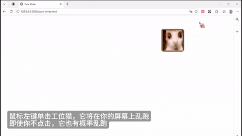
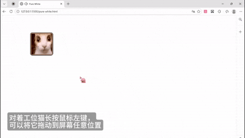

# Workstation Cat Desktop Pet

一个轻量的 Windows 桌宠小猫（便携版），解压后可直接运行。

`Workstation Cat Desktop Pet` is a lightweight portable desktop pet for Windows.

## 在线预览 / Demo

如果你的 GitHub 客户端支持内嵌图片，可直接在下方预览 GIF。  
If embedded preview is not shown, use the direct links:

- [Demo A (GIF)](./viewme/catpetA.gif)
- [Demo B (GIF)](./viewme/catpetB.gif)

<p align="center">
  
</p>
<p align="center">
  
</p>

## 运行方式 / Run

1. 下载或克隆本仓库。  
   Download or clone this repository.
2. 双击运行 `workstation-cat.exe`。  
   Double-click `workstation-cat.exe`.
3. 按住鼠标左键拖动猫咪窗口。  
   Drag the cat window with left mouse button.

## 环境要求 / Requirements

- Windows x64
- Microsoft WebView2 Runtime

## 目录结构 / Structure

```text
workstation-cat-desktop-pet/
├─ workstation-cat.exe
├─ README.md
└─ viewme/
   ├─ catpetA.gif
   └─ catpetB.gif
```

## 说明 / Notes

- 使用已确认的 10 帧工位猫循环动画。  
  Uses the approved 10-frame Workstation Cat avatar loop.
- 便携版不会创建开始菜单或卸载项。  
  Portable package does not create Start Menu/Uninstall entries.
